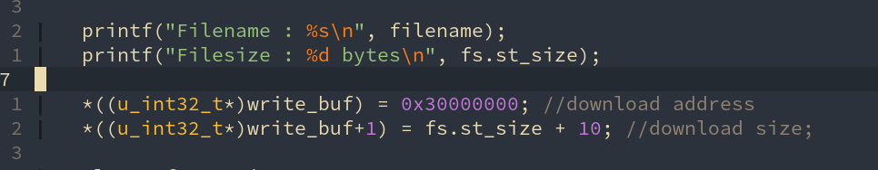
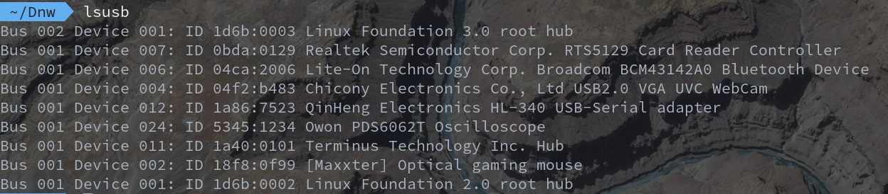

# Linux 下驱动开发软件之Dnw

#### [操作说明](./README.md)

## 安装步骤：
- [ ] 先检查系统有没有**libusb-dev**这个库，如果没有：
- **Ubuntu**: sudo apt-get install libusb-dev
- **Manjaro**: sudo pacman -S libusb-dev （好像系统自带）

- [ ] 进入dnw2.c这个文件的文件夹，然后就是**编译**了：
- gcc dnw2.c -o dnw -lusb

- [ ] 将生成的dnw**设置权限**（７７７）：
- chmod 777 dnw

- [ ] 干脆将生成的dnw创建链接，或者直接将dnw扔到/usr/bin/中,反正我是这么干的，嘻嘻。
- 生成链接: sudo ln -s ./dnw /usr/sbin/dnw
- 放到/usr/bin: sudo cp dnw /usr/bin

- [ ] 使用方法：
- dnw + filename 就可以下载到你的开发板了，速度还不错哦。

**注意** :
本程序下载的默认地址是**0X30000000**,如果你要下载的地址不是这个，请自行到程序dnw2.c自行修改。

### **具体流程**
- 打开开发板，插入usb下载线
- 查看自己usb的设备号，检查自己的设备号是不是5345:1234

- 如果不是这个设备号，请自行修改dnw2.c里的设备号

- 进行我上述的操作

